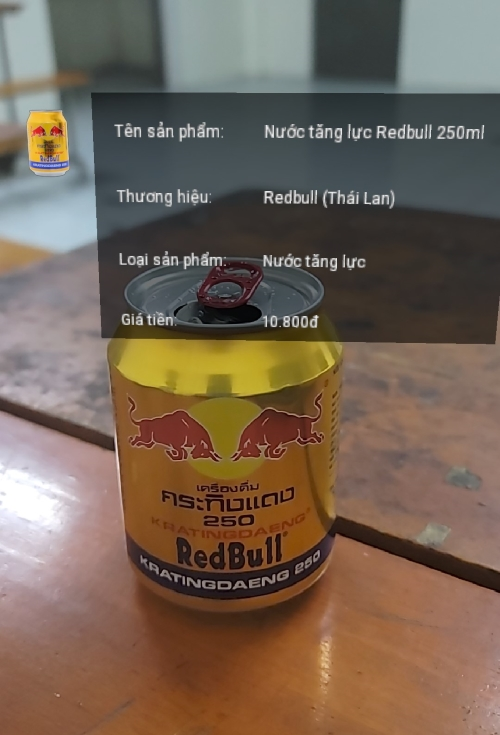

This is a new [**React Native**](https://reactnative.dev) project, bootstrapped using [`@react-native-community/cli`](https://github.com/react-native-community/cli).\
We use [**Viro library**](https://github.com/viromedia/viro) that detects and displays images and objects in real-time, presenting lifelike 3D models through augmented reality (AR)🕶️

# Video Preview




# Getting Started

> **Note**: Make sure you have completed the [React Native - Environment Setup](https://reactnative.dev/docs/environment-setup) instructions till "Creating a new application" step, before proceeding.

## Step 1: Install the dependencies

```bash
# using npm
npm install

# OR using Yarn
yarn install

# if you cant install, try:
npm install --legacy-peer-deps
```

## Step 2: Start your Application

You need to use real device to test or run this app.

```bash
# using npm
npm start

# OR using Yarn
yarn start
```

## Step 3: Add models to project

To add new model to project:

1. Create new folder in `assets/images` folder. Example: `assets/images/bohuc`
2. Add labels images of your model in this folder. Example: `assets/images/bohuc/bohuc1.jpg`
3. Create file: `{your_model}_images.tsx` in `utils` folder to define your model's images url. Example: `src/utils/bohuc_images.tsx`\
   I recommend you use chatGpt to generate url, you can follow my format in this file.
4. In `DetectObject.tsx` file, import your `{your_model}_images.tsx` file.
5. Add your model's infomations and images inside `utils/object_map` file.

Rebuild your project to see the result.

If app detect model successfully, it will show a text "Found Object {your_model}..." on screen.\
Expamle Log:

```bash
[LOG] Found Object bohuc {"anchorId": "49264808", "position": [-0.01319042220711708, -0.3073541224002838, -0.43637239933013916], "rotation": [36.71136178875351, -13.227428870237672, 24.101736335548186], "scale": [1, 1, 1], "trackingMethod": "tracking", "type": "image"}
```
